<p align="center">
  
</p>

---

```text
╔══════════════════════════════════════════════════════════════╗
║                                                              ║
║   ██████╗  ██████╗  ██████╗ ███████╗████████╗ █████╗ ██████╗  ║
║   ██╔══██╗██╔═══██╗██╔═══██╗██╔════╝╚══██╔══╝██╔══██╗██╔══██╗║
║   ██████╔╝██║   ██║██║   ██║███████╗   ██║   ███████║██████╔╝║
║   ██╔══██╗██║   ██║██║   ██║╚════██║   ██║   ██╔══██║██╔══██╗║
║   ██████╔╝╚██████╔╝╚██████╔╝███████║   ██║   ██║  ██║██║  ██║║
║   ╚═════╝  ╚═════╝  ╚═════╝ ╚══════╝   ╚═╝   ╚═╝  ╚═╝╚═╝  ╚═╝║
║                                                              ║
║   ⚡ Desktop-grade PC optimization for gamers                 ║
║                                                              ║
╚══════════════════════════════════════════════════════════════╝
```

<p align="center">
  <a href="https://myboostup.netlify.app"></a>&nbsp;
  <a href="https://myboostup.netlify.app/download.html"></a>&nbsp;
  <a href="https://github.com/farma3334"></a>
</p>

---

## 🎯 What is this?

A **Windows desktop app** that makes your PC run faster, your ping lower, and your games smoother — without the manual tinkering.

Think of it as a pit crew for your machine. 🏎️

---

## 🔧 What it does

| Tool | Effect |
|:-----|:-------|
| 🚀 **FPS Booster** | One-click system tuning for more frames |
| 🌐 **Network Optimizer** | Lower latency · smarter routing · faster DNS |
| 📊 **Hardware Monitor** | Live CPU / GPU / RAM / temps / traffic |
| 🎮 **Game Profiles** | Auto-optimizes when you launch a game |
| 🪶 **Lightweight** | Tiny footprint, zero bloat |

---

## 💾 System requirements

```
OS            :  Windows 10 / 11
Architecture  :  64-bit (x64)
RAM           :  4 GB minimum
Disk Space    :  200 MB free
```

---

## ⏳ Status

> **Coming soon.** The full release is being polished right now.
> Stay in the loop on the [website](https://myboostup.netlify.app).

---

<p align="center">
  <sub>Built by <a href="https://github.com/farma3334"><b>Farma</b></a> · Public overview only — source code kept private.</sub>
</p>
